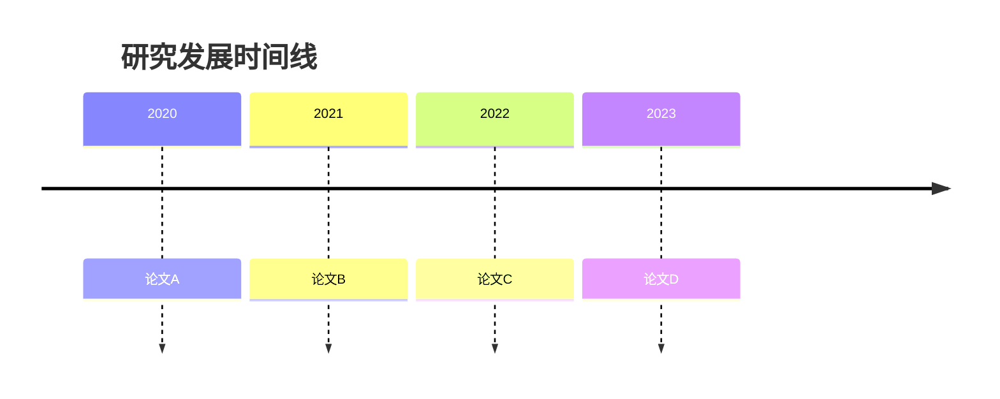

# 文献综述: {{topic}}

## 📖 研究主题

> 简要描述这个综述的主题和范围

## 🔍 检索策略

### 关键词

- 

### 数据库

- [ ] Google Scholar
- [ ] Semantic Scholar
- [ ] arXiv
- [ ] DBLP
- [ ] Connected Papers

## 📊 论文列表

### 核心论文

| # | 论文 | 年份 | 方法 | 关键贡献 | 状态 |
|---|------|------|------|----------|------|
| 1 | [[Paper 1]] | | | | |
| 2 | [[Paper 2]] | | | | |
| 3 | [[Paper 3]] | | | | |

### 相关论文

| # | 论文 | 年份 | 方法 | 关键贡献 | 状态 |
|---|------|------|------|----------|------|
| 1 | [[Paper 4]] | | | | |
| 2 | [[Paper 5]] | | | | |

## 📈 发展脉络

## 🧩 方法分类

### 基于方法1

- [[Paper A]]: 
- [[Paper B]]: 

### 基于方法2

- [[Paper C]]: 
- [[Paper D]]: 

## 📊 性能对比

| 方法 | 数据集1 | 数据集2 | 数据集3 | 优点 | 缺点 |
|------|---------|---------|---------|------|------|
| Method A | | | | | |
| Method B | | | | | |
| Method C | | | | | |

## 🔬 研究空白

1. **空白1**: 
2. **空白2**: 
3. **空白3**: 

## 💡 未来方向

1. 
2. 
3. 

## 📝 总结

> 用3-5句话总结这个领域的现状和趋势