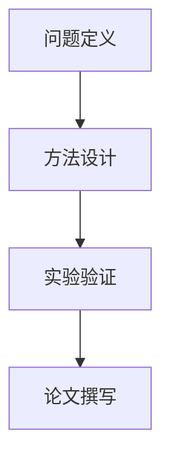

# 🔬 项目: {{project_name}}

## 📋 项目概述

> 一句话描述项目目标

## 🎯 研究问题

**主要问题**: 

**子问题**:
1. 
2. 
3. 

## 📚 文献基础

### 核心参考论文

| 论文 | 方法 | 可借鉴点 |
|------|------|----------|
| [[Paper 1]] | | |
| [[Paper 2]] | | |
| [[Paper 3]] | | |

### 研究空白

- 

## 💡 核心想法

### 创新点

1. 
2. 
3. 

### 技术路线

## 📊 实验计划

### 阶段一: 

- [ ] 任务1
- [ ] 任务2
- **预计时间**: 

### 阶段二: 

- [ ] 任务1
- [ ] 任务2
- **预计时间**: 

### 阶段三: 

- [ ] 任务1
- [ ] 任务2
- **预计时间**: 

## 📈 进度跟踪

| 阶段 | 开始日期 | 结束日期 | 状态 | 备注 |
|------|----------|----------|------|------|
| 阶段一 | | | ⬜ 未开始 | |
| 阶段二 | | | ⬜ 未开始 | |
| 阶段三 | | | ⬜ 未开始 | |

## 🔗 相关资源

- 代码仓库: 
- 数据集: 
- 预训练模型: 

## 📝 会议记录

### {{date}}

- 讨论内容: 
- 决议: 
- 下一步: 

## ❓ 待解决问题

- [ ] 问题1: 
- [ ] 问题2: 

## 📖 参考资料

- 
- 